# Tarea 2 Catálogo interactivo de interfaces móviles

**Nombre:** David Alexis Hernandez Gonzalez  
**Boleta:** 2024630227  
**Grupo:** 7CV4  
**Asignatura:** Aplicaciones móviles

## Descripción

Este proyecto implementa un catálogo de componentes de interfaz en tres tecnologías: Android con Kotlin y Views/XML, Android con Kotlin y Jetpack Compose, y Flutter con Dart. Cada versión contiene una pantalla principal y seis secciones con explicaciones y demostraciones interactivas.

Las secciones son entrada de texto, botones y acciones, selección, listas y colecciones, información y retroalimentación, y contenedores y estructura. Las aplicaciones incluyen navegación, textos en español y configuración de tema claro y oscuro según el sistema.

La conexión entre secciones permite capturar un nombre en **Entrada de texto**, pulsar **Agregar a la lista** y encontrarlo en **Listas y colecciones**. Los datos de demostración se mantienen en memoria durante la ejecución; no se utiliza una base de datos ni se garantiza su conservación al cerrar el proceso.

## Organización

```text
android-views/       Kotlin, Fragments y layouts XML
android-compose/     Kotlin y funciones composable
flutter/             Dart y pantallas Flutter
apks/                Instaladores Android
docs/
  views/             Seis capturas de Views/XML
  compose/           Seis capturas de Jetpack Compose
  flutter/           Seis capturas de Flutter
README.md
```

En Views, cada categoría tiene un Fragment y la actividad aloja la navegación. Compose selecciona el composable correspondiente desde su menú lateral. Flutter utiliza una pantalla por categoría y un menú lateral. Las tres versiones permiten regresar al inicio mediante una acción en la barra superior.

## Compilación y ejecución

### Preparación

1. Clonar el repositorio:

   ```bash
   git clone https://github.com/Alexis177/Tarea-2-Moviles.git
   cd Tarea-2-Moviles
   ```

2. Instalar Android Studio y los paquetes de Android SDK que solicite la sincronización. Los proyectos nativos tienen `compileSdk` y `targetSdk` 37, y `minSdk` 24.
3. Configurar el JDK de Gradle compatible con el proyecto desde Android Studio. Usar los Gradle Wrapper incluidos; no es necesario instalar Gradle por separado.
4. Para Flutter, instalar Flutter SDK y configurar su carpeta `bin` en PATH. El archivo `pubspec.yaml` requiere Dart `>=3.11.0 <4.0.0`; usar una versión de Flutter compatible con el código y ejecutar `flutter doctor`.
5. Conectar un teléfono con depuración USB habilitada o iniciar un emulador. Se necesita conexión a internet para descargar dependencias y mostrar la imagen remota.

Los siguientes comandos se ejecutan en PowerShell, partiendo de la raíz del repositorio en cada bloque. Si Flutter no está en PATH, sustituir `flutter` por la ruta de su ejecutable; en el equipo de desarrollo se utilizó `& "D:\Flutter\flutter\bin\flutter.bat"`.

### Android con Views/XML

Abrir `android-views` en Android Studio, esperar la sincronización, seleccionar el dispositivo y pulsar **Run**. Para generar el APK:

```powershell
cd android-views
.\gradlew.bat assembleDebug
```

Salida: `android-views/app/build/outputs/apk/debug/app-debug.apk`.

### Android con Jetpack Compose

Abrir `android-compose` en Android Studio, sincronizar Gradle, seleccionar el dispositivo y pulsar **Run**. Para generar el APK:

```powershell
cd android-compose
.\gradlew.bat assembleDebug
```

Salida: `android-compose/app/build/outputs/apk/debug/app-debug.apk`.

### Flutter

Abrir `flutter` con el complemento de Flutter en Android Studio o utilizar la terminal:

```powershell
cd flutter
flutter pub get
flutter analyze
flutter test
flutter run
```

Para generar el APK de entrega:

```powershell
flutter build apk --release
```

Salida: `flutter/build/app/outputs/flutter-apk/app-release.apk`.

### APK incluidos

| Versión | Instalador | Tipo de compilación |
|---|---|---|
| Views/XML | [Descargar APK](apks/catalogo-views.apk) | Debug |
| Jetpack Compose | [Descargar APK](apks/catalogo-compose.apk) | Debug |
| Flutter | [Descargar APK](apks/catalogo-flutter.apk) | Release |

Descargar el archivo desde GitHub y abrirlo en Android para instalarlo.

## Tabla de equivalencias

### 1. Entrada de texto

| Elemento | Views/XML | Jetpack Compose | Flutter |
|---|---|---|---|
| Texto simple con etiqueta | `TextInputLayout` y `TextInputEditText` | `OutlinedTextField` | `TextField` con `InputDecoration` |
| Validación y error | `TextInputLayout.error` | `OutlinedTextField`, `isError` y texto de apoyo | `TextField` y `errorText` |
| Contraseña visible/oculta | `TextInputLayout` con `password_toggle` | Transformación de contraseña e `IconButton` | `obscureText` e `IconButton` |
| Teclado numérico | `inputType="number"` | `KeyboardOptions` y `KeyboardType.Number` | `TextInputType.number` |
| Teclado de correo | `inputType="textEmailAddress"` | `KeyboardType.Email` | `TextInputType.emailAddress` |
| Teclado de teléfono | `inputType="phone"` | `KeyboardType.Phone` | `TextInputType.phone` |
| Texto multilínea | Campo con `textMultiLine` | `OutlinedTextField` multilínea | `TextField` con varias líneas |
| Sugerencias | `AppCompatAutoCompleteTextView` y `ArrayAdapter` | Campo y lista de sugerencias seleccionables | `Autocomplete<String>` |
| Búsqueda | `SearchView` | `OutlinedTextField` con búsqueda y limpieza | `SearchBar` |

### 2. Botones y acciones

| Elemento | Views/XML | Jetpack Compose | Flutter |
|---|---|---|---|
| Botón relleno | `MaterialButton` | `Button` | `FilledButton` |
| Botón con contorno | `MaterialButton` con estilo de contorno | `OutlinedButton` | `OutlinedButton` |
| Botón de texto | `MaterialButton` con estilo de texto | `TextButton` | `TextButton` |
| Solo ícono | `ImageButton` | `FilledIconButton` | `IconButton.filled` |
| Ícono y texto | `MaterialButton` con ícono | `Button`, `Icon` y `Text` | `FilledButton.icon` |
| FAB normal | `FloatingActionButton` | `FloatingActionButton` | `FloatingActionButton` |
| FAB extendido | `ExtendedFloatingActionButton` | `ExtendedFloatingActionButton` | `FloatingActionButton.extended` |
| Selector segmentado | `MaterialButtonToggleGroup` | `SingleChoiceSegmentedButtonRow` y `SegmentedButton` | `SegmentedButton` |
| Deshabilitado | `isEnabled = false` | `enabled = false` | `onPressed: null` |
| Estado de carga | Botón e indicador de progreso | Botón y `CircularProgressIndicator` | Botón y `CircularProgressIndicator` |

Los botones habilitados muestran un mensaje o modifican un estado visible. El botón deshabilitado demuestra deliberadamente la ausencia de interacción.

### 3. Selección

| Elemento | Views/XML | Jetpack Compose | Flutter |
|---|---|---|---|
| Casilla | `MaterialCheckBox` | `Checkbox` | `CheckboxListTile` |
| Casilla indeterminada | Estado indeterminado de `MaterialCheckBox` | `TriStateCheckbox` | `CheckboxListTile` con `tristate` |
| Opciones excluyentes | `RadioGroup` y `MaterialRadioButton` | `RadioButton` con estado compartido | `RadioGroup` y `RadioListTile` |
| Interruptor | `MaterialSwitch` | `Switch` | `SwitchListTile` |
| Deslizador simple | `Slider` | `Slider` | `Slider` |
| Deslizador de rango | `RangeSlider` | `RangeSlider` | `RangeSlider` |
| Desplegable | `Spinner` | `DropdownMenu` y `DropdownMenuItem` | `DropdownMenu` |
| Fecha | `DatePickerDialog` de Android | `DatePickerDialog` de Android invocado desde Compose | `showDatePicker` |
| Hora | `TimePickerDialog` de Android | `TimePickerDialog` de Android invocado desde Compose | `showTimePicker` |
| Chips seleccionables | `ChipGroup` y `Chip` de filtro | `FilterChip` | `FilterChip` |

### 4. Listas y colecciones

| Elemento | Views/XML | Jetpack Compose | Flutter |
|---|---|---|---|
| Lista de quince elementos iniciales | `RecyclerView` y `LinearLayoutManager` | `LazyColumn` | `ListView.builder` |
| Cuadrícula | `RecyclerView` y `GridLayoutManager` | `LazyVerticalGrid` | `GridView.builder` |
| Encabezados y filas | Tipos de vista distintos en el adaptador | Elementos de encabezado y filas en `LazyColumn` | Encabezados y filas en una lista |
| Detalle al seleccionar | `MaterialAlertDialogBuilder` | `AlertDialog` | Pantalla de detalle con `Navigator` |
| Deslizar para eliminar | `ItemTouchHelper` | Detección de arrastre horizontal y desplazamiento de la fila | `Dismissible` |
| Arrastrar para actualizar | `SwipeRefreshLayout` | `PullToRefreshBox` | `RefreshIndicator` |
| Estado vacío | Layout con ilustración, texto y acción | Ícono, texto y botón | Ícono, texto y botón |
| Pestañas deslizables | `TabLayout`, `ViewPager2` y `FragmentStateAdapter` | `TabRow` y `HorizontalPager` | `DefaultTabController`, `TabBar` y `TabBarView` |

### 5. Información y retroalimentación

| Elemento | Views/XML | Jetpack Compose | Flutter |
|---|---|---|---|
| Estilos de texto | `TextView` y estilos tipográficos | `Text` y tipografía Material | `Text`, `TextStyle` y `Text.rich` |
| Imagen local | `ImageView` con recurso drawable | `Image` y `painterResource` | `Image.asset` |
| Imagen desde URL | `HttpURLConnection`, `BitmapFactory` e `ImageView` | Descarga de bitmap e `Image` | `Image.network` |
| Escalado de imagen | `fitCenter` y `centerCrop` | `ContentScale.Fit` y `ContentScale.Crop` | `BoxFit.contain`, `cover` y `fill` |
| Progreso lineal determinado | `LinearProgressIndicator` con valor | `LinearProgressIndicator` con progreso | `LinearProgressIndicator` con `value` |
| Progreso lineal indeterminado | `LinearProgressIndicator` indeterminado | `LinearProgressIndicator` sin progreso | `LinearProgressIndicator` sin `value` |
| Progreso circular determinado | `CircularProgressIndicator` con valor | `CircularProgressIndicator` con progreso | `CircularProgressIndicator` con `value` |
| Progreso circular indeterminado | `CircularProgressIndicator` indeterminado | `CircularProgressIndicator` sin progreso | `CircularProgressIndicator` sin `value` |
| Mensaje breve tipo toast | `Toast` de Android | `Toast` de Android | Equivalente visual con `OverlayEntry`, `Material` y temporizador |
| Snackbar con acción | `Snackbar` y acción Deshacer | `SnackbarHost` y acción Deshacer | `SnackBar` y `SnackBarAction` |
| Confirmación | `MaterialAlertDialogBuilder` | `AlertDialog` | `showDialog` y `AlertDialog` |
| Hoja inferior | `BottomSheetDialog` | `ModalBottomSheet` | `showModalBottomSheet` |
| Tarjeta | `MaterialCardView` | `Card` | `Card` |
| Separador | `MaterialDivider` | `HorizontalDivider` | `Divider` |
| Distintivo numérico | `BadgeDrawable` y `BadgeUtils` | `BadgedBox` y `Badge` | `Badge` |

### 6. Contenedores y estructura

| Elemento | Views/XML | Jetpack Compose | Flutter |
|---|---|---|---|
| Fila | `LinearLayout` horizontal | `Row` | `Row` |
| Columna | `LinearLayout` vertical | `Column` | `Column` |
| Superposición | `FrameLayout` | `Box` | `Stack`, `Positioned` y `Align` |
| Desplazamiento vertical | `NestedScrollView` | `verticalScroll` | `SingleChildScrollView` |
| Barra superior con acciones | `MaterialToolbar` | `TopAppBar` | `AppBar` |
| Navegación inferior de demostración | `BottomNavigationView` | `NavigationBar` | `NavigationBar` |
| Pesos proporcionales | `LinearLayout.LayoutParams.weight` | `Modifier.weight` | `Expanded` y `flex` |

## Capturas de pantalla

Las siguientes 18 capturas corresponden a las aplicaciones ejecutadas en el teléfono. Cada imagen muestra una parte de la sección.

### Android con Views/XML

| Entrada de texto | Botones y acciones |
|---|---|
| 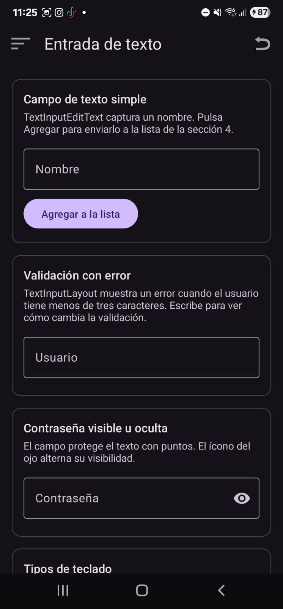 | 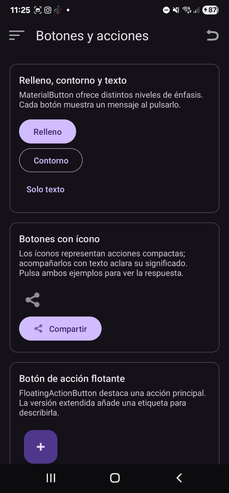 |

| Selección | Listas y colecciones |
|---|---|
| 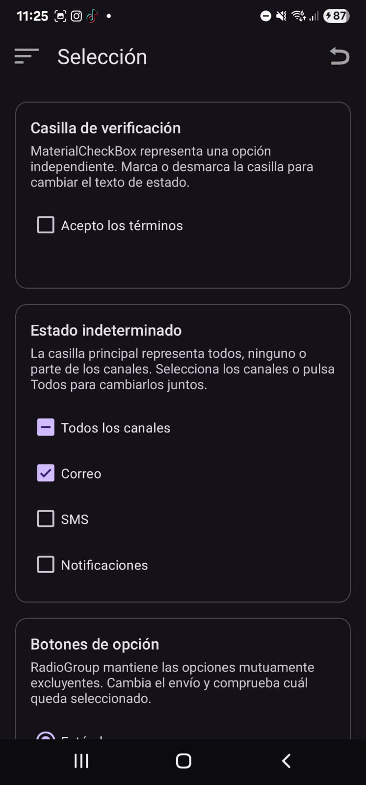 | 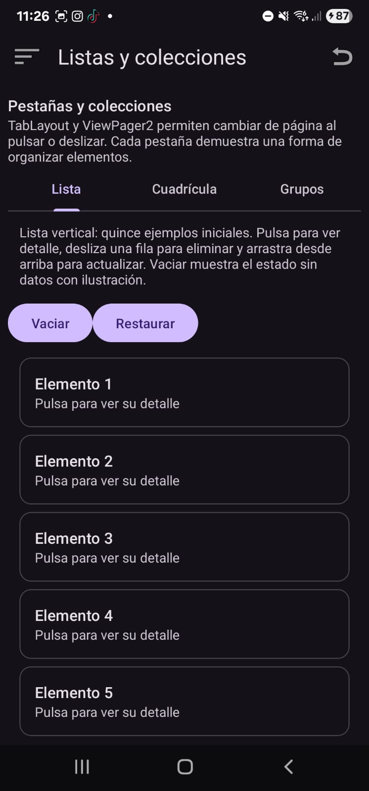 |

| Información | Contenedores |
|---|---|
| 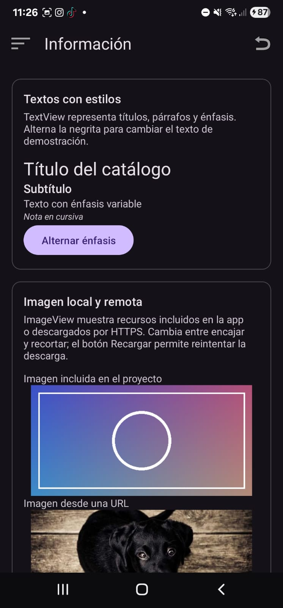 | 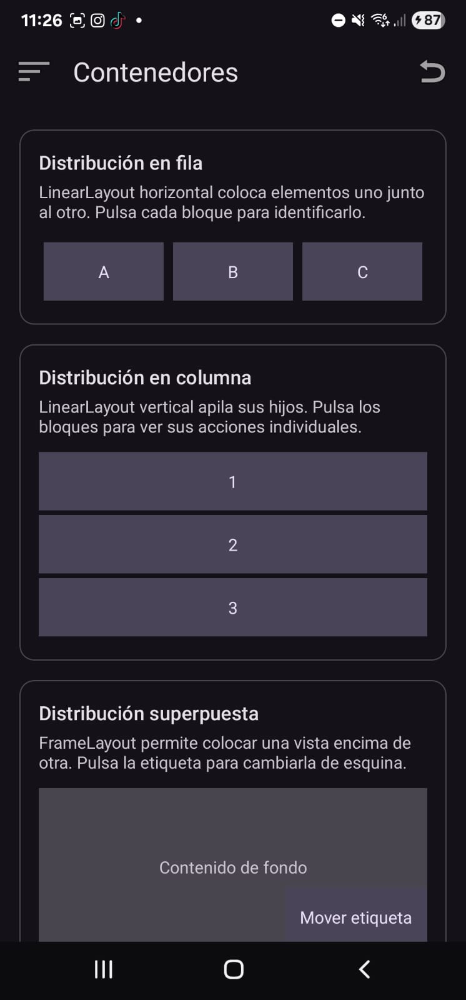 |

### Android con Jetpack Compose

| Entrada de texto | Botones y acciones |
|---|---|
| 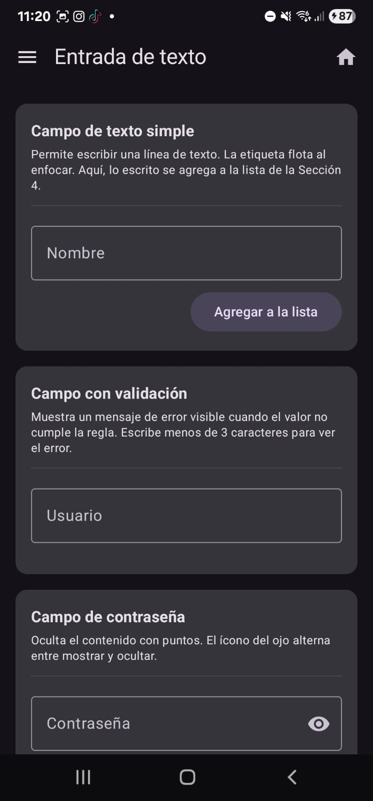 | 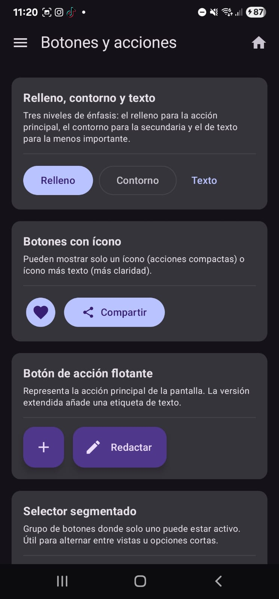 |

| Selección | Listas y colecciones |
|---|---|
| 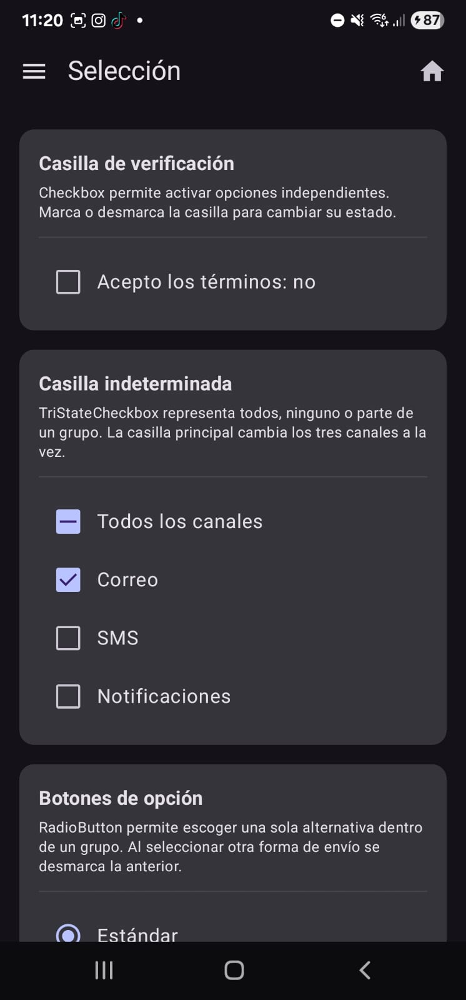 | 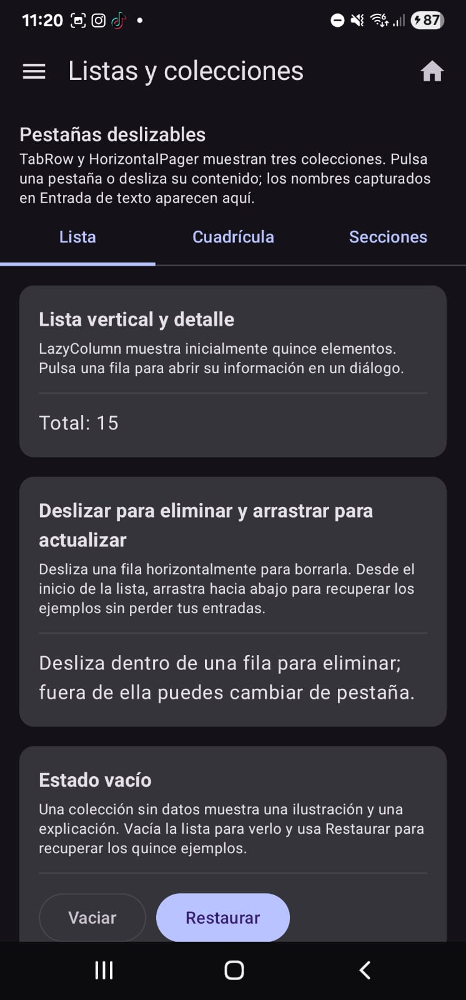 |

| Información | Contenedores |
|---|---|
| 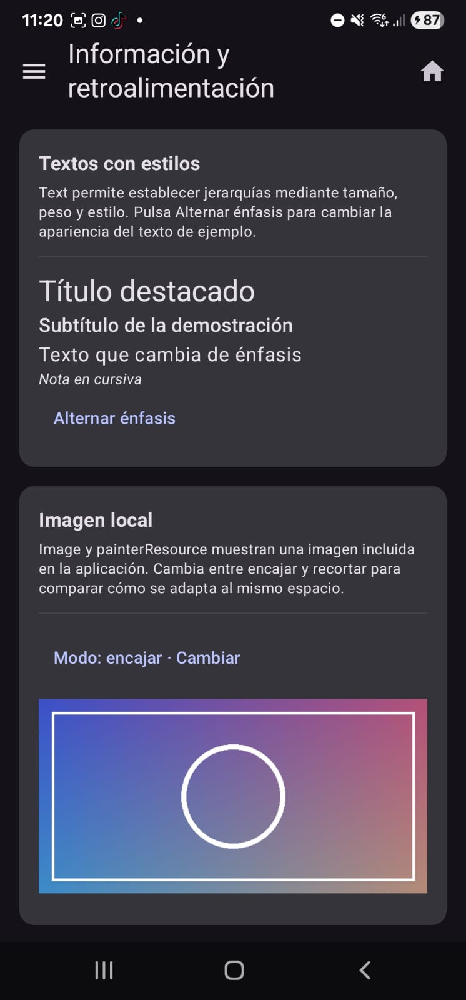 | 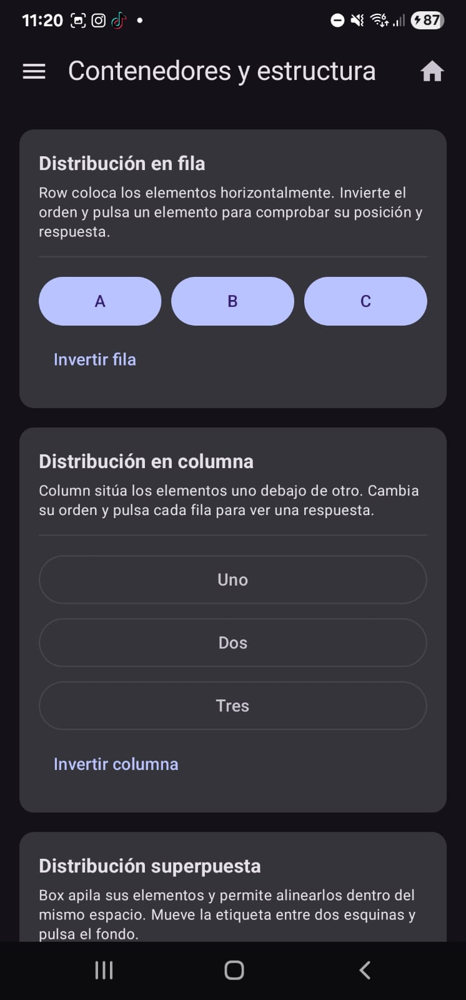 |

### Flutter

| Entrada de texto | Botones y acciones |
|---|---|
| 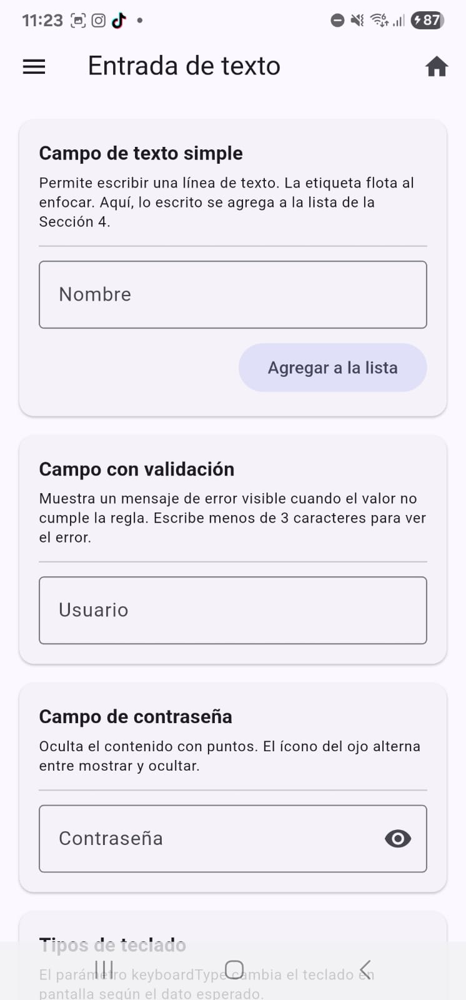 | 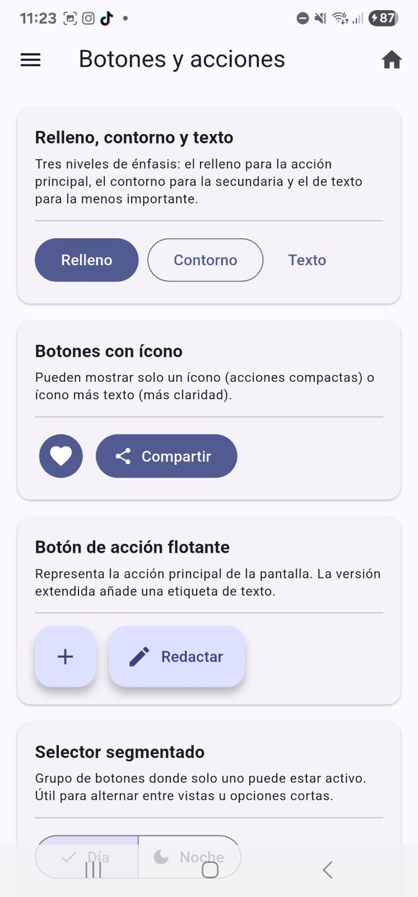 |

| Selección | Listas y colecciones |
|---|---|
| 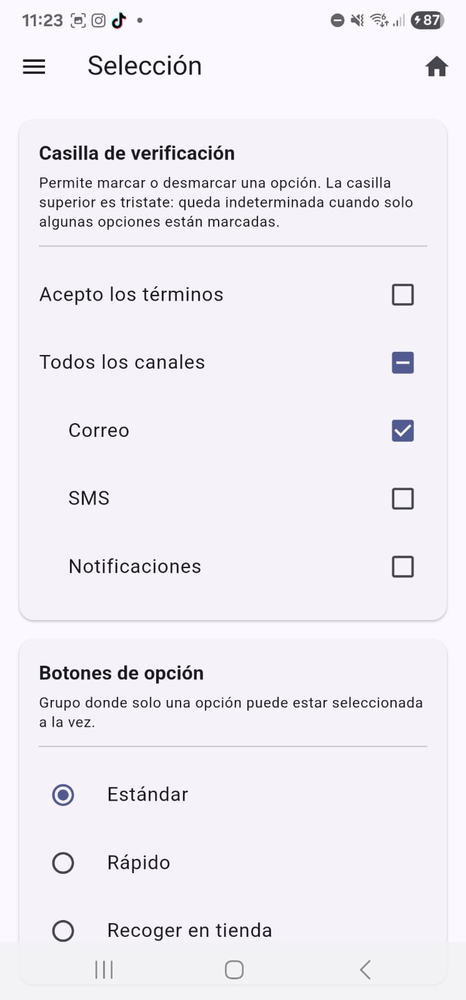 | 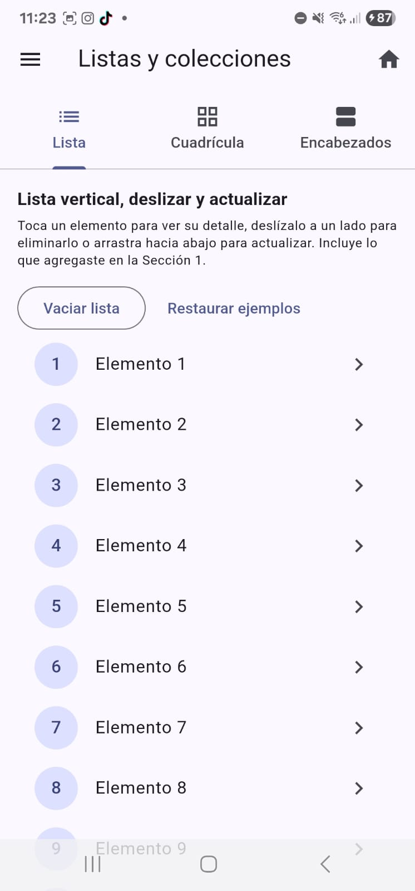 |

| Información | Contenedores |
|---|---|
| 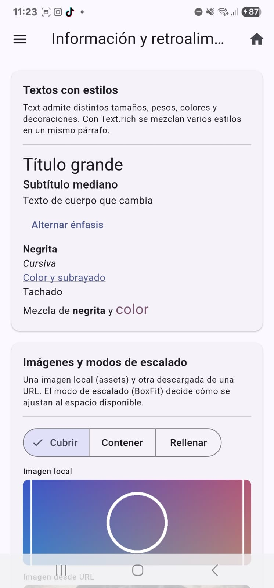 | 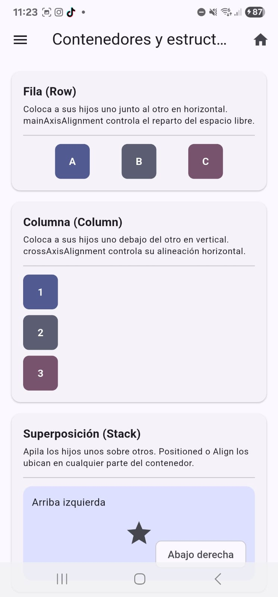 |

## Reflexión personal

Jetpack Compose fue la tecnología que me resultó más fácil para construir la interfaz y la que tuvo el código más claro. No medí el tiempo de desarrollo de cada versión, por lo que mi comparación se basa en la facilidad que experimenté al trabajar con ellas.

Flutter fue la tecnología que más se me complicó. En esta comparación no identifiqué un componente específico como la causa principal de esa dificultad. En Views/XML, la interfaz y su comportamiento se encuentran distribuidos entre los layouts XML y el código Kotlin; en Compose, la interfaz se expresa mediante funciones composable, y en Flutter mediante widgets de Dart. Estas diferencias permiten comparar distintas maneras de organizar una misma aplicación.

No identifiqué una dificultad concreta adicional en Views/XML ni en Compose. Para un siguiente proyecto preferiría volver a utilizar **Jetpack Compose**, porque fue la opción con la que me sentí más cómodo y cuyo código me resultó más legible.

## Referencias

Google. (2026, 23 de septiembre). *Create a fragment*. Android Developers. https://developer.android.com/guide/fragments/create

Google. (s. f.). *Material Components*. Android Developers. Recuperado el 25 de septiembre de 2026, de https://developer.android.com/develop/ui/compose/components

Google. (s. f.). *Material component widgets*. Flutter. Recuperado el 25 de septiembre de 2026, de https://docs.flutter.dev/ui/widgets/material
